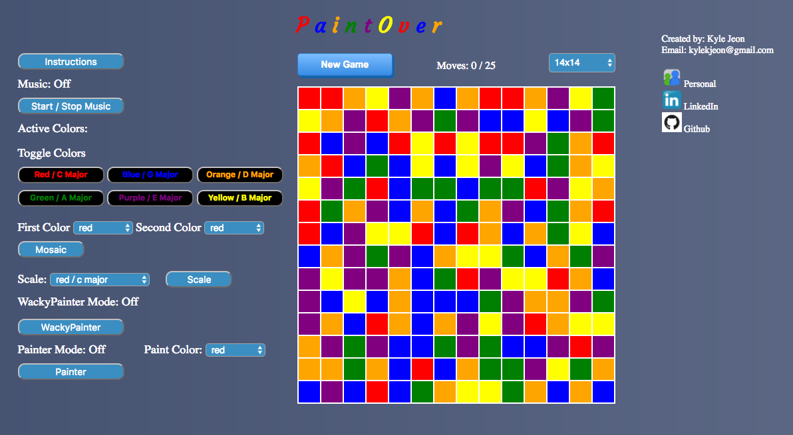

# PaintOver

A front-end javascript project mixing the classic game of flood-it, a game where you try to flood the whole board with a single color, with a javascript audio sequencer, to create sounds based on the color and position of individual squares on the board.

## Architecture and Technologies

This project is implemented with the following technologies:

- Vanilla JavaScript and jQuery for structure/game logic
- CSS for styling, HTML for event-listeners and basic structures
- Webpack to bundle and serve up various scripts
- Github pages for hosting
- Tone.js, an audio sequencing library, for step-sequencing.

### Features

with PaintOver, users are able to:

 - start, pause, and reset the flood-board
 - select squares adjacent to the current flooded color board
 - Have a set number of moves to clear the level
 - Have a sequencer that detects the colors of the block and creates the appropriate noise

In addition, this project includes:

 - An instruction modal describing the rules of the game
 - A music start/stop button
 - The ability to toggle specific colors for sounds
 - Two different "paint" modes to manipulate the board
 - Various other features for manipulating the grid colors.

## Future Plans for this Project

### Song Persistence
  A feature that allows users to save and capture specific grid patterns to save the musical sequence associated

### Sound-color association
  A feature allowing users to select a sound to attach to a specific color

### Tempo
  A feature allowing users to change the tempo of the sequencer
